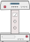

.. image:: https://img.shields.io/travis/mabuchilab/Instrumental/master.svg
    :target: https://travis-ci.org/mabuchilab/Instrumental
    :alt: Travis CI

.. image:: https://img.shields.io/appveyor/ci/natezb/Instrumental/master.svg
    :target: https://ci.appveyor.com/project/natezb/instrumental
    :alt: AppVeyor CI

.. image:: https://img.shields.io/pypi/v/Instrumental-lib.svg
    :target: https://pypi.python.org/pypi/Instrumental-lib
    :alt: PyPI

.. image:: https://readthedocs.org/projects/instrumental-lib/badge/
   :target: https://instrumental-lib.readthedocs.io
   :alt: Documentation

|logo| Instrumental
===================

Instrumental is a Python-based library for controlling lab hardware like cameras, DAQs,
oscilloscopes, spectrometers, and more. It has high-level drivers for instruments from NI,
Tektronix, Thorlabs, PCO, Photometrics, Burleigh, and others.

Instrumental's goal is to make common tasks simple to perform, while still providing the
flexibility to perform complex tasks with relative ease. It also makes it easy to mess around with
instruments in the shell. For example, to list the available instruments and open one of them::

    >>> from instrumental import instrument, list_instruments
    >>> insts = list_instruments()
    >>> insts
    [<TEKTRONIX 'DPO4034'>, <TEKTRONIX 'MSO4034'>, <NIDAQ 'Dev1'>]
    >>> daq = instrument(insts[2])
    >>> daq
    <instrumental.drivers.daq.ni.NIDAQ at 0xb61...>

If you're going to be using an instrument repeatedly, save it for later::

    >>> daq.save_instrument('myDAQ')

Then you can simply open it by name::

    >>> daq = instrument('myDAQ')

Instrumental also bundles in some additional support code, including:

* Plotting and curve fitting utilities
* Utilities for acquiring and organizing data

Instrumental makes use of NumPy, SciPy, Matplotlib, and Pint, a Python units
library. It optionally uses PyVISA/VISA and other drivers for interfacing with
lab equipment.

For install information, documentation, examples, and more, see our page on
`ReadTheDocs <http://instrumental-lib.readthedocs.org/>`_.

