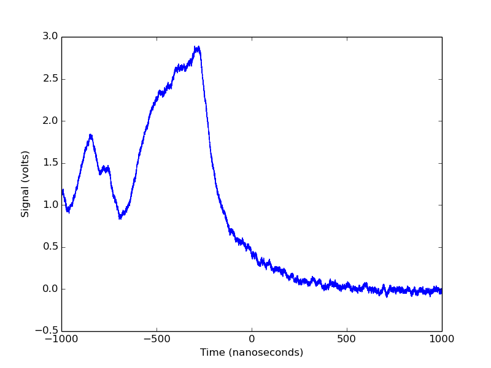
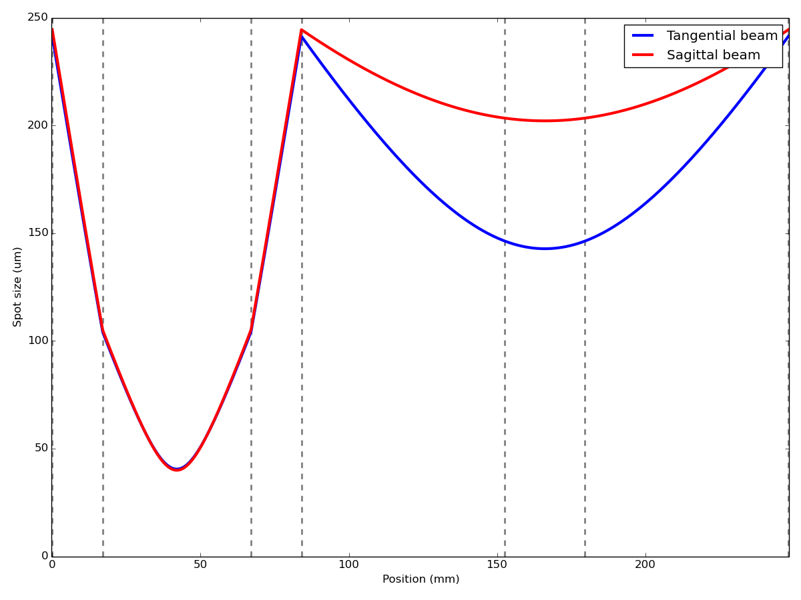
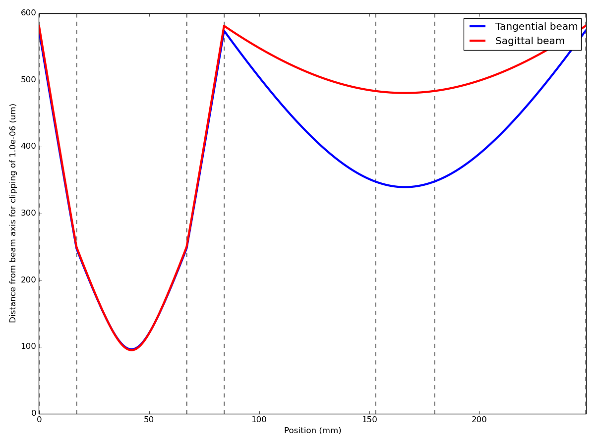

Quickstart
==========

Using Instruments
-----------------

Much of Instrumental's utility is in its ability to communicate with lab
equipment. Our goal is to make interfacing with equipment as simple and
powerful as it should be.

Connecting to a VISA instrument is easy::

    >>> from instrumental import instrument
    >>> scope = instrument(visa_address='TCPIP::0.0.0.1::INSTR')
    >>> scope
    <instrumental.drivers.scopes.tektronix.TDS_3000 object at 0x7f...>

It can be even easier if you've already set up an alias in your
`instrumental.conf` file::

    >>> scope = instrument('myScopeAlias')
    <instrumental.drivers.scopes.tektronix.TDS_3000 object at 0x7f...>

For more detailed info, see :doc:`instruments`. Now we can use our new scope
object to grab some data::

    >>> x, y = scope.get_data()
    >>> x
    <Quantity([-9.99800000e-07, ..., 1.00000000e-06], 'second')>
    >>> y
    <Quantity([1.13007813, ..., -0.04835938], 'volt')>

Notice that our data already has units! By default, the scope grabs data from
its first channel. We can grab data from the other channel by using::

    >>> x, y = scope.get_data(channel=2)

Now let's plot our data::

    >>> import instrumental.plotting as plt
    >>> plt.plot(x.to('ns'), y)
    >>> plt.ylabel('Signal')
    >>> plt.xlabel('Time')
    >>> plt.show()

This gives us

But... where did those unit labels come from? Instrumental's wrapped versions
of `xlabel` and `ylabel` add them automatically so you don't have to.

-------------------------------------------------------------------------------

Solving for and Plotting a Cavity Mode
--------------------------------------

A common use case for working with ray transfer matrices is solving for a
cavity mode and looking at the mode's spatial profile. Instrumental makes this
easy. Here's a short script that constructs a bowtie cavity with a crystal
inside, solves for its tangential and sagittal modes, and plots them::

    from instrumental import (plotting as plt, Space, Mirror, Interface,
                             find_cavity_modes, plot_profile)
    # Indices of refraction
    n0, nc = 1, 2.18

    # Create cavity elements
    cavity_elems = [Mirror(R='50mm', aoi='18deg'), Space('1.7cm'),
                    Interface(n0, nc), Space('5cm', nc),
                    Interface(nc, n0), Space('1.7cm'),
                    Mirror(R='50mm', aoi='18deg'), Space('6.86cm'),
                    Mirror(), Space('2.7cm'),
                    Mirror(), Space('6.86cm')]

    # Find tangential and sagittal cavity modes
    qt_r, qs_r = find_cavity_modes(cavity_elems)
    
    # Beam profile inside the cavity
    plot_profile(qt_r, qs_r, '1064nm', cavity_elems, cyclical=True)
    plt.legend()
    plt.show()

This will produce a plot that looks something like

We might also be interested in any losses from clipping, or aperture effects.
To look at this, we can simply change the plotting line to::

    plot_profile(qt_r, qs_r, '1064nm', cavity_elems, cyclical=True,
                 clipping=1e-6)

This will now plot the radial distance at which power losses from clipping
become 1 part per million, i.e. 1e-6.

This example makes good use of Instrumental's unit-friendliness. We're using
all sorts of length scales here, from nanometers to centimeters, all handled
simply and explicitly. Are some of your lengths in inches? No problem! No more
wondering "...is this variable the wavelength in nanometers, or in meters?"
